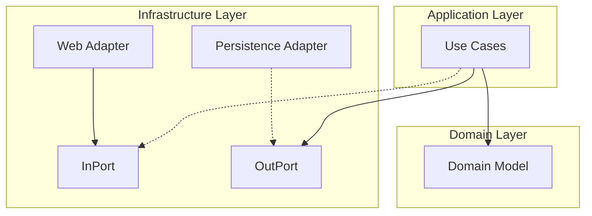
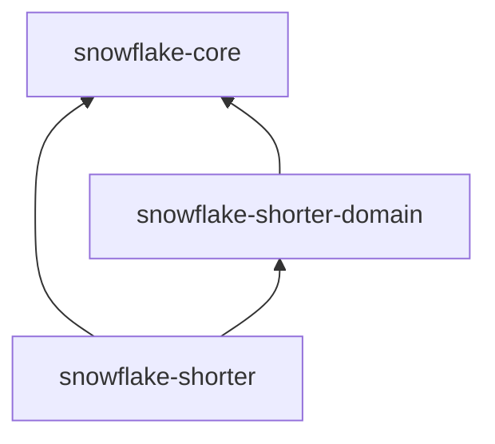

# 🏗️ 아키텍처 (Architecture)

## 🗺️ 개요

Snowflake URL Shorter는 **Hexagonal Architecture (Ports and Adapters)** 패턴을 기반으로 설계되었습니다. 비즈니스 로직을 외부 기술(Web, Database 등)
로부터 격리하여 유지보수성과 테스트 용이성을 극대화하는 것을 목표로 합니다.

> 💡 **설계 철학**: 왜 이런 아키텍처를 선택했는지 궁금하다면 [DESIGN_PHILOSOPHY.md](DESIGN_PHILOSOPHY.md)를 참고하세요.

---

## 🏛️ 시스템 구조 (System Structure)

### 계층 구조 (Layered Architecture)

### 물리적 모듈 구조 (Multi-Module)

시스템은 계층 간 결합도를 물리적으로 제어하기 위해 3개의 모듈로 분리되어 있습니다.

1. **`snowflake-core`**:
    * Snowflake ID 생성 알고리즘을 담은 순수 Kotlin 라이브러리.
    * Spring 등 모든 인프라 의존성 배제.
2. **`snowflake-shorter-domain`**:
    * URL 단축 서비스의 핵심 비즈니스 로직 및 모델.
    * 외부 데이터 규격(JPA)이나 프레임워크(Spring) 어노테이션이 없는 **Pure Domain Layer**.
    * 외부 세상을 향한 인터페이스(**Ports**) 정의.
3. **`snowflake-shorter`**:
    * 실행 가능한 애플리케이션 및 인프라 구현체(**Adapters**).
    * WebFlux, JPA, Redis 등 구체적인 기술 스택 포함.
    * 도메인 로직을 감싸는 Application Layer(UseCase) 및 설정 포함.

### 의존성 규칙 (Dependency Rules)

* **핵심 원칙**: 안쪽(Domain)은 바깥쪽(Adapter)을 전혀 알지 못합니다.
* **DIP(의존성 역전 원칙)**: 인프라 기술(Redis)은 도메인이 정의한 추상 인터페이스(`RateLimiter` 포트 등)를 구현함으로써 도메인에 플러그인됩니다.

---

## 🔄 데이터 흐름 (Data Flow)

### 단축 URL 생성 흐름 (7-Step Flow)

1. **Rate Limiting**: `RateLimitFilter`에서 클라이언트 IP를 식별하고 Redis Lua 스크립트를 통해 허용 여부를 즉시 확인합니다.
2. **Request Handling**: `Web Adapter`가 요청을 검증하고 `ShortenUrlUseCase`를 호출합니다.
3. **ID Generation & Encoding**: Snowflake ID 생성 및 Base62 인코딩을 수행합니다.
4. **Transactional Outbox**: **핵심 비즈니스 트랜잭션** 내에서 생성된 매핑 정보를 `outbox` 테이블에 기록합니다. (데이터 영속성 보장)
5. **Caching**: 생성된 정보를 Redis에 Coroutines 스타일로 즉시 기록합니다. (조회 성능 확보)
6. **Event Publishing**: 비동기 처리를 위해 내부 이벤트를 발행합니다.
7. **Response**: 저장 완료 여부와 관계없이 생성된 단축 URL을 클라이언트에게 즉시 응답(201 Created)합니다.

### Outbox Relay (Background Processing)

* **Relay Worker**: 주기적으로 `outbox` 테이블을 폴링하여 처리되지 않은 이벤트를 추출합니다.
* **Final Persistence**: 추출된 데이터를 실제 `shorter_history` 테이블로 이관(Batch)하고 성공 시 Outbox 데이터를 삭제합니다. (At-least-once delivery)

### 조회 및 리다이렉트 흐름

1. **Cache First**: Redis에서 `short:{key}`로 데이터를 조회합니다.
2. **DB Fallback**: 캐시 미스 시 MySQL에서 조회하고, 결과를 다시 Redis에 적재합니다. (Read-Through)
3. **Redirect**: 원본 URL로 `302 Found` 응답을 전송합니다.

## 📊 관측성 (Observability)

고가용성 시스템을 유지하기 위해 상세한 메트릭을 수집하고 모니터링합니다.

### 1. Virtual Thread Monitoring

Java 21의 Virtual Thread는 OS 스레드와 1:1로 매핑되지 않으므로, 기존 방식으로는 모니터링이 어렵습니다. 이를 위해 **Micrometer**의 `VirtualThreadMetrics`를
도입했습니다.

* **Pinned Threads**: Blocking I/O 등으로 인해 OS 스레드에 고정(Pin)된 Virtual Thread 개수 모니터링
* **Active Threads**: 현재 활성화된 Virtual Thread 수 추적
* **Executor Stats**: Virtual Thread를 스케줄링하는 ForkJoinPool의 상태 모니터링

### 2. Custom Metrics

* **Snowflake ID**: Worker별 ID 할당 속도 및 고갈(Exhaustion) 여부
* **URL Shortening**: Base62 인코딩/디코딩 처리 시간
* **DLQ**: 처리 실패율 및 재시도 성공률

---

## 📚 상세 문서 가이드

각 컴포넌트의 상세 구현 내용은 아래 문서들을 참고하세요.

* **[DLQ.md](features/DLQ.md)**: 장애 격리 및 재처리 메커니즘 상세
* **[ID_GENERATION.md](features/ID_GENERATION.md)**: Snowflake ID 생성 알고리즘 및 Worker 관리
* **[URL_SHORTENING.md](features/URL_SHORTENING.md)**: Base62 인코딩 및 URL 단축 로직
* **[STRATEGY.md](testing/STRATEGY.md)**: 테스트 전략 및 환경 구성
