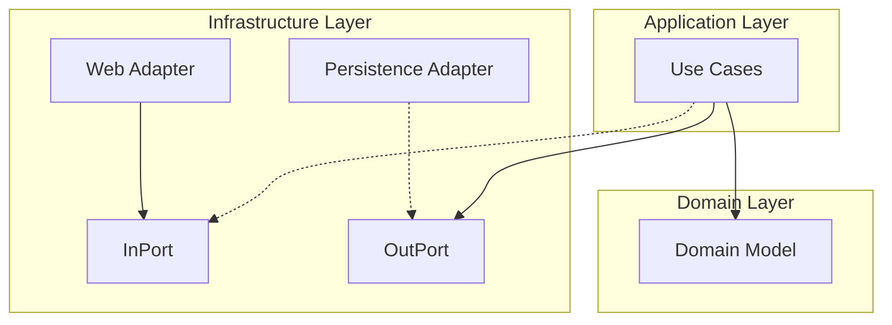

# 🏗️ 아키텍처 (Architecture)

## 🗺️ 개요

Snowflake URL Shorter는 **Hexagonal Architecture (Ports and Adapters)** 패턴을 기반으로 설계되었습니다. 비즈니스 로직을 외부 기술(Web, Database 등)로부터 격리하여 유지보수성과 테스트 용이성을 극대화하는 것을 목표로 합니다.

> 💡 **설계 철학**: 왜 이런 아키텍처를 선택했는지 궁금하다면 [DESIGN_PHILOSOPHY.md](DESIGN_PHILOSOPHY.md)를 참고하세요.

---

## 🏛️ 시스템 구조 (System Structure)

### 계층 구조 (Layered Architecture)

### 1. Domain Layer (Core)
비즈니스 로직의 핵심입니다. 프레임워크나 라이브러리에 의존하지 않는 순수한 Kotlin 코드로 작성됩니다.
*   **Model**: `ShortUrl`, `FailedEvent` 등 핵심 비즈니스 객체
*   **Port**: 외부와 통신하기 위한 인터페이스 정의

### 2. Application Layer (Orchestration)
도메인 객체를 사용하여 비즈니스 유스케이스를 흐름대로 제어합니다.
*   **UseCase**: 트랜잭션 관리 및 비즈니스 흐름 조정

### 3. Adapter Layer (Infrastructure)
애플리케이션과 외부 세계를 연결합니다.
*   **Inbound**: HTTP 요청 처리 (WebFlux Handlers)
*   **Outbound**: DB 접근 (JPA Repositories), 외부 시스템 통신

---

## 🔄 데이터 흐름 (Data Flow)

### 단축 URL 생성 흐름

1.  **Request**: 클라이언트가 `POST /shorten` 요청
2.  **Web Adapter**: 요청을 받아 `ShortenUrlUseCase` 호출
3.  **Application**:
    *   [Snowflake ID 생성](features/ID_GENERATION.md)
    *   [Base62 인코딩](features/URL_SHORTENING.md)
    *   `ShortUrlCreatedEvent` 발행 (비동기 처리)
4.  **Response**: 즉시 단축 URL 응답 (Low Latency)
5.  **Persistence**:
    *   이벤트 리스너가 이벤트를 버퍼링하여 배치 저장
    *   실패 시 [Dead Letter Queue](features/DLQ.md)로 이동

---

## 📊 관측성 (Observability)

고가용성 시스템을 유지하기 위해 상세한 메트릭을 수집하고 모니터링합니다.

### 1. Virtual Thread Monitoring
Java 21의 Virtual Thread는 OS 스레드와 1:1로 매핑되지 않으므로, 기존 방식으로는 모니터링이 어렵습니다. 이를 위해 **Micrometer**의 `VirtualThreadMetrics`를 도입했습니다.
*   **Pinned Threads**: Blocking I/O 등으로 인해 OS 스레드에 고정(Pin)된 Virtual Thread 개수 모니터링
*   **Active Threads**: 현재 활성화된 Virtual Thread 수 추적
*   **Executor Stats**: Virtual Thread를 스케줄링하는 ForkJoinPool의 상태 모니터링

### 2. Custom Metrics
*   **Snowflake ID**: Worker별 ID 할당 속도 및 고갈(Exhaustion) 여부
*   **URL Shortening**: Base62 인코딩/디코딩 처리 시간
*   **DLQ**: 처리 실패율 및 재시도 성공률

---

## 📚 상세 문서 가이드

각 컴포넌트의 상세 구현 내용은 아래 문서들을 참고하세요.

*   **[DLQ.md](features/DLQ.md)**: 장애 격리 및 재처리 메커니즘 상세
*   **[ID_GENERATION.md](features/ID_GENERATION.md)**: Snowflake ID 생성 알고리즘 및 Worker 관리
*   **[URL_SHORTENING.md](features/URL_SHORTENING.md)**: Base62 인코딩 및 URL 단축 로직
*   **[STRATEGY.md](testing/STRATEGY.md)**: 테스트 전략 및 환경 구성
