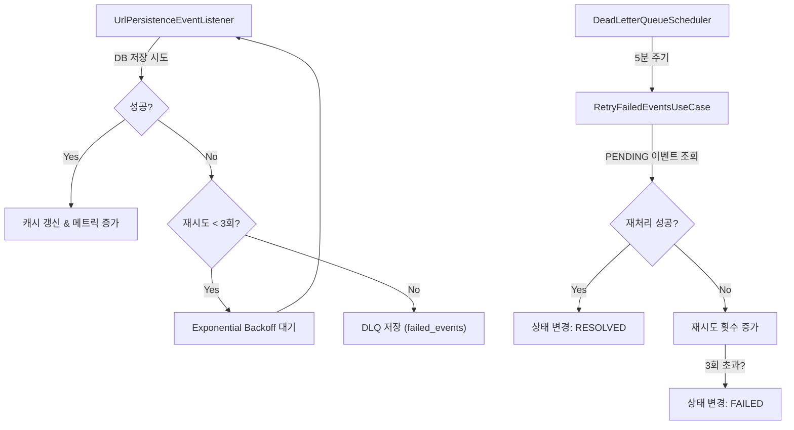

# 🔄 Dead Letter Queue (DLQ)

## 📋 개요

Snowflake URL Shorter는 **Dead Letter Queue (DLQ)** 패턴을 사용하여 일시적인 장애로 인한 데이터 손실을 방지하고, 시스템의 회복 탄력성(Resilience)을 보장합니다. DB 저장 실패 시 이벤트를 버리지 않고 별도 저장소(`failed_events`)에 보관한 뒤, 백그라운드 스케줄러를 통해 자동으로 재처리를 시도합니다.

---

## 🏗️ 아키텍처

### 처리 흐름



### 상태 전이 (State Transition)

*   **PENDING**: 초기 상태. 재처리 대기 중.
*   **PROCESSING**: 재처리 작업 진행 중.
*   **RESOLVED**: 재처리 성공. (7일 후 자동 삭제)
*   **FAILED**: 최대 재시도 횟수 초과로 영구 실패. (수동 개입 필요)

---

## ⚙️ 기능 명세

### 1. 도메인 모델 (`FailedEvent`)
*   **불변성**: `incrementRetry()`, `withStatus()` 등을 통해 상태 변경 시 새로운 객체 반환
*   **재시도 제한**: `MAX_RETRY_COUNT = 3`

### 2. 재시도 전략 (Exponential Backoff)
*   일시적 장애(네트워크 튀김 등)를 고려하여 지수 백오프 적용
*   초기 지연: 100ms, 최대 지연: 10초, 계수: 2.0

### 3. 데이터베이스 스키마 (`failed_events`)

```sql
CREATE TABLE failed_events (
    id BIGINT AUTO_INCREMENT PRIMARY KEY,
    short_url VARCHAR(255) NOT NULL,
    long_url TEXT NOT NULL,
    created_at BIGINT NOT NULL,
    failed_at BIGINT NOT NULL,
    retry_count INT NOT NULL DEFAULT 0,
    last_error TEXT,
    status VARCHAR(50) NOT NULL DEFAULT 'PENDING',
    INDEX idx_status (status),
    INDEX idx_failed_at (failed_at),
    INDEX idx_status_retry_count (status, retry_count)
);
```

### 4. 스케줄러 정책
*   **재시도 (Retry)**: 5분마다 실행. `PENDING` 상태 이벤트를 조회하여 재처리 시도.
*   **정리 (Cleanup)**: 매일 자정 실행. 7일 이상 된 `RESOLVED` 이벤트 삭제.

---

## 📊 모니터링

### Prometheus 메트릭
*   `url_persistence_success_total`: 성공한 배치 수
*   `url_persistence_failure_total`: 실패한 배치 수
*   `url_persistence_dlq_total`: **DLQ로 넘어간 이벤트 수 (Alert 대상)**

### 운영 쿼리

```sql
-- 재시도 대기 중인 이벤트 확인
SELECT * FROM failed_events WHERE status = 'PENDING' ORDER BY failed_at;

-- 영구 실패 이벤트 확인 (조치 필요)
SELECT * FROM failed_events WHERE status = 'FAILED';
```

---

## ⚙️ 설정 (`application.yml`)

```yaml
snowflake:
  dlq:
    retry:
      initial-delay: 60000    # 재시도 스케줄러 초기 지연 (1분)
      fixed-delay: 300000     # 재시도 주기 (5분)
    cleanup:
      cron: "0 0 0 * * ?"     # 정리 스케줄 (매일 자정)
```
