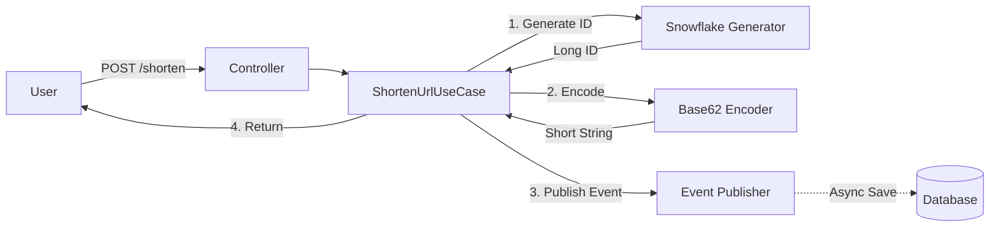

# 🔗 URL Shortening Logic

## 🎯 개요
긴 URL을 짧은 URL로 변환하는 핵심 로직에 대해 설명합니다. **Snowflake ID**를 생성한 후 이를 **Base62**로 인코딩하여 사용자에게 제공하는 방식을 사용합니다.

---

## 🔄 단축 프로세스 (Shortening Process)

### 1. ID 생성 (ID Generation)
먼저 [Snowflake 알고리즘](ID_GENERATION.md)을 통해 전역적으로 유일한 64비트 Long ID를 생성합니다.
*   예: `173849201849201`

### 2. Base62 인코딩 (Base62 Encoding)
생성된 Long ID를 **Base62** 문자열로 변환합니다. Base64와 달리 URL에 안전하지 않은 문자(`+`, `/`, `=`)를 제외한 `[a-zA-Z0-9]` 62개 문자만 사용합니다.

#### 특징 (`Base62Encoder.kt`)
*   **Shuffled Alphabet**: 보안성을 높이고 예측 가능성을 낮추기 위해, 표준 순서(`0-9a-zA-Z`)가 아닌 **무작위로 섞은 알파벳 셋**을 사용합니다.
    *   Alphabet: `wFjR2pTqYx4Ua7sKv9dHnC0mZl1bGeOi3u6I8E5rBAcWJdXPQfyMLzNtVkGS`
*   **짧은 길이**: 64비트 정수를 인코딩하면 최대 11자 이내의 짧은 문자열이 생성됩니다.

### 3. 비동기 저장 (Write-Behind)
사용자 응답 지연(Latency)을 최소화하기 위해 **Event Sourcing** 패턴과 유사한 방식을 사용합니다.

1.  단축 URL 생성 즉시 `ShortUrlCreatedEvent`를 발행합니다.
2.  사용자에게는 DB 저장 결과를 기다리지 않고 **즉시 응답(201 Created)**을 반환합니다.
3.  별도의 이벤트 리스너가 이벤트를 구독하여 DB에 비동기로 저장합니다.
4.  저장 실패 시 [Dead Letter Queue (DLQ)](DLQ.md)로 이동하여 재처리를 보장합니다.

---

## 🔍 조회 및 리다이렉트 (Retrieval)

1.  사용자가 단축 URL로 접속 (`GET /{shortKey}`)
2.  **Redis Cache** 조회 (Cache Hit 시 즉시 리턴)
3.  Cache Miss 시 **DB** 조회 후 캐시 적재 (Read-Through)
4.  원본 URL로 `302 Found` 리다이렉트 응답 (브라우저 캐싱 방지 또는 301 사용 결정 가능)
