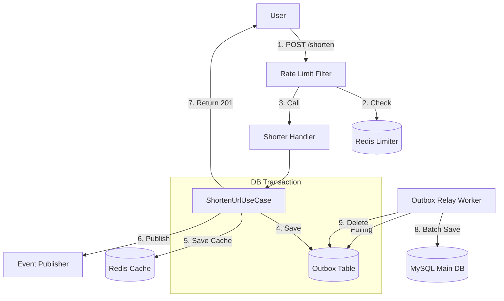

# 🔗 URL Shortening Logic

## 🎯 개요
긴 URL을 짧은 URL로 변환하는 핵심 로직에 대해 설명합니다. **Snowflake ID**를 생성한 후 이를 **Base62**로 인코딩하여 사용자에게 제공하는 방식을 사용합니다.

---

## 🔄 단축 프로세스 (Shortening Process)

### 1. 처리율 제한 (Rate Limiting)
서비스 안정성을 위해 `RateLimitFilter`가 모든 `/shorten` 요청을 선제적으로 차단하거나 허용합니다. Redis Lua 스크립트를 사용하여 원자적(Atomic)으로 카운트를 관리합니다.

### 2. 고유 키 생성 (ID Generation & Encoding)
1.  [Snowflake 알고리즘](ID_GENERATION.md)으로 64비트 유일 정수를 생성합니다.
2.  **Base62** 인코딩을 통해 `http://sh.rt/aB34X`와 같은 짧은 키로 변환합니다.
3.  도메인 서비스(`ShortUrlGenerator`) 내에서 저장소에 키가 존재하는지 확인(Collision Check)하여 충돌을 방지합니다.

### 3. 삼중 보장 저장 전략 (Triple-Reliability Persistence)
1.  **Transactional Outbox**: 비즈니스 트랜잭션 내에서 `outbox` 테이블에 이벤트를 먼저 영속화하여, 애플리케이션 장애 시에도 데이터 유실을 방지합니다.
2.  **Write-Through (Cache)**: Redis에 즉시 저장하여 이어지는 첫 번째 조회부터 즉각적인 성능을 보장합니다.
3.  **Outbox Relay**: 백그라운드 워커가 Outbox 데이터를 메인 DB로 안전하게 이관하며 **At-least-once delivery**를 실현합니다.

---

## 🔍 조회 및 리다이렉트 (Retrieval)

1.  사용자가 단축 URL로 접속 (`GET /{shortKey}`)
2.  **Redis Cache** 조회 (Cache Hit 시 즉시 리턴)
3.  Cache Miss 시 **DB** 조회 후 캐시 적재 (Read-Through)
4.  원본 URL로 `302 Found` 리다이렉트 응답 (브라우저 캐싱 방지 또는 301 사용 결정 가능)
