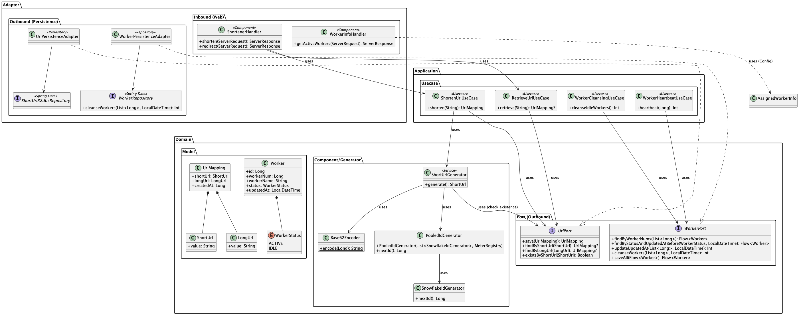
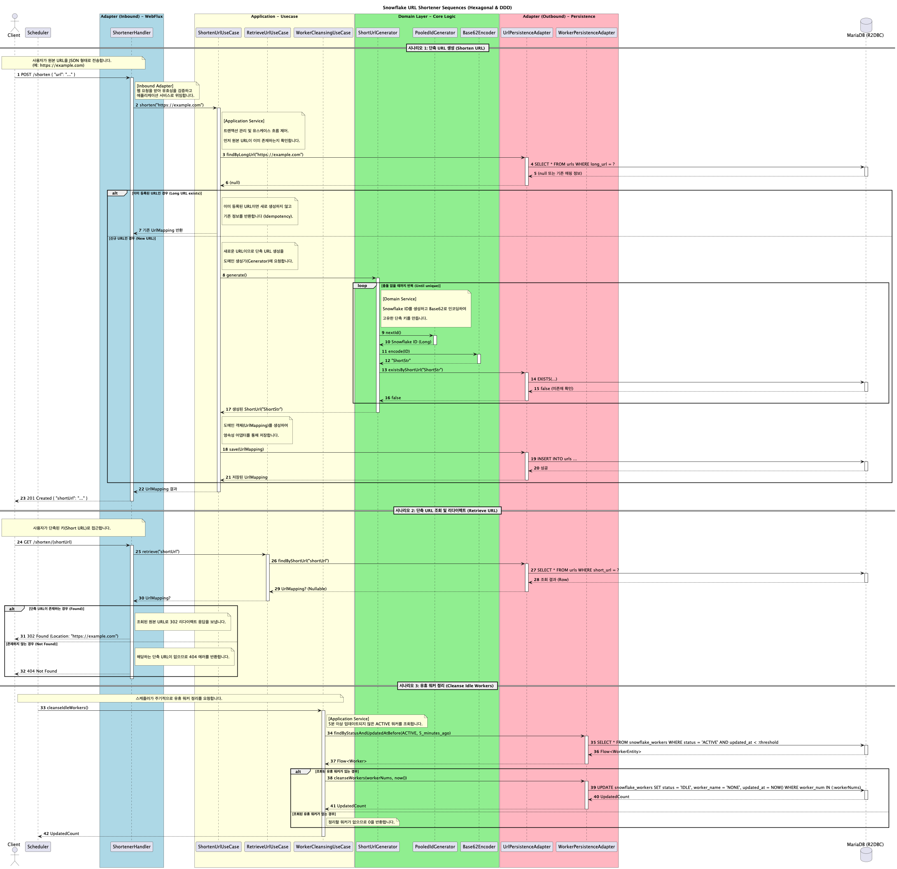

# ❄️ Snowflake URL Shortener - Architecture & Design

이 문서는 **Snowflake URL Shortener** 프로젝트의 아키텍처, 디렉토리 구조, 핵심 설계 원칙 및 기술적 의사결정 사항을 상세히 기술합니다.

---

## 1. 아키텍처 개요 (Architecture Overview)

이 프로젝트는 **Hexagonal Architecture (Ports and Adapters)** 패턴을 기반으로 설계되었습니다. 비즈니스 로직을 외부 기술(Web, Database 등)로부터 격리하여 유지보수성과 테스트 용이성을 극대화하는 것을 목표로 합니다.

### 핵심 원칙
- **Dependency Rule (의존성 규칙)**: 모든 의존성은 외부에서 내부(도메인)로 향합니다. 도메인 계층은 외부 계층(Web, Persistence)에 대해 전혀 알지 못합니다.
- **DDD (Domain-Driven Design)**: 풍부한 도메인 모델과 Value Object를 사용하여 비즈니스 개념을 명확히 표현합니다.
- **Reactive & Non-blocking**: Spring WebFlux와 Kotlin Coroutines를 사용하여 완전한 논블로킹 I/O를 구현, 높은 동시성을 처리합니다.

---

## 2. 계층 구조 및 클래스 다이어그램 (Layered Structure & Class Diagram)

아래 다이어그램은 프로젝트의 계층 구조와 주요 컴포넌트 간의 관계를 보여줍니다. **Adapter**가 **Application**을, **Application**이 **Domain**을 사용하는 구조입니다.



### 📂 `domain` (Core)
비즈니스 로직의 핵심입니다. 프레임워크나 라이브러리에 의존하지 않는 순수한 Kotlin 코드로 작성됩니다.
- **`model`**: Entity, Value Object (예: `ShortUrl`, `LongUrl`, `Worker`).
- **`port`**: 외부와 통신하기 위한 인터페이스 정의.
    - **`inbound`**: 외부에서 도메인을 사용하기 위한 인터페이스 (Use Cases).
    - **`outbound`**: 도메인이 외부 저장소 등을 사용하기 위한 인터페이스 (Repositories).

### 📂 `application` (Orchestration)
도메인 객체를 사용하여 비즈니스 유스케이스를 흐름대로 제어하는 역할을 합니다.
- **`usecase`**: `Inbound Port`를 구현하며, `Outbound Port`를 호출하여 로직을 수행합니다. 트랜잭션 관리가 여기서 이루어집니다.
- **`usecase/worker`**: 워커 관리를 위한 유스케이스들을 포함합니다.

### 📂 `adapter` (Infrastructure)
애플리케이션과 외부 세계를 연결합니다.
- **`inbound`**: HTTP 요청을 받아 애플리케이션 포트를 호출합니다 (WebFlux Handlers, Routers).
- **`outbound`**: 애플리케이션의 아웃바운드 포트를 구현하여 실제 DB나 외부 시스템과 통신합니다 (R2DBC Persistence).

---

## 3. 핵심 로직 시퀀스 (Core Logic Sequence)

**단축 URL 생성**과 **조회** 과정의 상세 흐름입니다.



---

## 4. 디렉토리 구조 (Directory Structure)

```text
io.dave.shortener
├── adapter                  # [Infrastructure Layer]
│   ├── inbound              # 외부 요청 처리
│   │   ├── dto              # Request/Response DTOs
│   │   ├── handler          # WebFlux Handlers (Controller 역할)
│   │   ├── router           # URL Routing 설정
│   │   └── GlobalErrorWebExceptionHandler.kt # 전역 에러 처리
│   └── outbound             # 외부 리소스 접근
│       └── persistence      # DB 접근 구현
│           ├── entity       # DB 테이블 매핑 엔티티
│           ├── repository   # R2DBC Repository
│           └── Adapter.kt   # Outbound Port 구현체
├── application              # [Application Layer]
│   └── usecase              # 비즈니스 유스케이스 구현
│       └── worker           # 워커 관리를 위한 유스케이스
├── config                   # Spring 설정 (R2DBC, Snowflake 등)
└── domain                   # [Domain Layer]
    ├── component            # 도메인 서비스 (ShortUrlGenerator)
    ├── generator            # ID 생성 및 인코딩 로직 (Snowflake, Base62)
    ├── model                # 핵심 비즈니스 객체 (Value Objects)
    └── port                 # 인터페이스 정의 (Ports)
        └── outbound         # Output Ports (Repositories)
```

---

## 5. 핵심 기술 및 설계 결정 (Key Design Decisions)

### 5.1. Snowflake ID Generator (분산 ID 생성)
URL 단축 서비스의 핵심 요구사항인 **높은 처리량(High Throughput)**과 **낮은 데이터 사용량**을 달성하기 위해 **Twitter Snowflake** 알고리즘을 채택했습니다.
- **도입 배경**:
    - **Performance**: DB 시퀀스나 UUID(128bit, 문자열)와 달리, 메모리 내에서 비트 연산만으로 ID를 생성하므로 락(Lock) 없이 극도로 빠른 생성이 가능합니다.
    - **Efficiency**: 64bit 정수(`Long`) 하나에 타임스탬프와 시퀀스가 모두 포함되어 있어, DB 인덱싱 효율이 매우 높고 저장 공간을 절약합니다.
    - **Uniqueness**: 분산 환경에서도 서버(Worker) ID만 다르면 절대 중복되지 않는 ID 생성을 보장합니다.
- **구조**: `1bit(Sign)` + `41bits(Timestamp)` + `10bits(WorkerID)` + `12bits(Sequence)` = **64bit Long**.
- **Worker Management**: 분산 환경에서 Worker ID 충돌을 방지하기 위해 R2DBC를 사용하여 DB(`snowflake_workers` 테이블)를 통해 동적으로 Worker ID를 할당하고 관리합니다.
    - **Active/Idle 상태 관리**: 주기적으로 Heartbeat를 보내고, 오랫동안 응답 없는 Worker ID를 회수하여 재사용합니다 (`WorkerCleansingService`).
- **데이터베이스 스키마**:
    Snowflake ID 할당 및 단축 URL 저장을 위한 핵심 테이블 구조는 다음과 같습니다.

    **`shortener_history` 테이블** (단축 URL 매핑)

    | 컬럼명      | 타입      | 제약 조건                | 설명               |
    | :---------- | :-------- | :----------------------- | :----------------- |
    | `id`        | `BIGINT`  | `PRIMARY KEY`, `AUTO_INCREMENT` | 고유 ID             |
    | `short_url` | `VARCHAR(255)` | `NOT NULL`, `UNIQUE`    | 단축된 URL 키       |
    | `long_url`  | `TEXT`    | `NOT NULL`               | 원본 긴 URL        |
    | `created_at`| `TIMESTAMP` | `NOT NULL`, `DEFAULT CURRENT_TIMESTAMP` | 생성 시각           |

    **`snowflake_workers` 테이블** (Snowflake 워커 ID 할당 및 관리)

    | 컬럼명      | 타입      | 제약 조건                | 설명                       |
    | :---------- | :-------- | :----------------------- | :------------------------- |
    | `id`        | `BIGINT`  | `PRIMARY KEY`, `AUTO_INCREMENT` | 고유 ID                     |
    | `worker_num`| `BIGINT`  | `NOT NULL`, `UNIQUE`    | 워커 번호 (0~255)         |
    | `worker_name`| `VARCHAR(255)` | `NOT NULL`               | 워커 이름 (호스트명 등)     |
    | `status`    | `VARCHAR(50)` | `NOT NULL`               | 워커 상태 (ACTIVE, IDLE)  |
    | `created_at`| `TIMESTAMP` | `NOT NULL`, `DEFAULT CURRENT_TIMESTAMP` | 생성 시각                   |
    | `updated_at`| `TIMESTAMP` | `NOT NULL`, `DEFAULT CURRENT_TIMESTAMP ON UPDATE CURRENT_TIMESTAMP` | 마지막 업데이트 시각         |

    *초기 데이터**: `snowflake_workers` 테이블에는 워커 번호 0부터 255까지의 256개 초기 데이터가 'IDLE' 상태로 삽입됩니다. 이 데이터는 애플리케이션 시작 시 워커 ID를 할당하는 데 사용됩니다.

### 5.2. Kotlin Coroutines over Reactor
Spring WebFlux는 기본적으로 Reactor(Mono/Flux)를 사용하지만, 비즈니스 로직의 가독성과 유지보수성을 위해 **Kotlin Coroutines**를 전면 도입했습니다.
- **Imperative Style**: 콜백 지옥이나 연산자 체이닝 없이 직관적인 명령형 스타일로 비동기 코드를 작성합니다.
- **Integration**: `CoWebExceptionHandler`, `awaitSingle`, `flow` 등을 통해 WebFlux와 매끄럽게 연동합니다.

### 5.3. R2DBC (Reactive Relational Database Connectivity)
완전한 논블로킹 스택을 유지하기 위해 JDBC 대신 **R2DBC**를 사용합니다.
- MariaDB/MySQL과 비동기적으로 통신하며, 높은 트래픽 상황에서도 스레드 풀 고갈 없이 효율적인 리소스 사용이 가능합니다.

### 5.4. Observability & Monitoring
운영 환경에서의 안정성과 성능을 보장하기 위해 포괄적인 모니터링 체계를 구축했습니다.

- **Micrometer & Prometheus**: Spring Boot Actuator와 Micrometer를 사용하여 애플리케이션 메트릭을 수집하고, `/actuator/prometheus` 엔드포인트를 통해 Prometheus로 노출합니다.
- **Custom Metrics**:
    - `snowflake_id_generation_time_seconds`: ID 생성 소요 시간 (Histogram).
    - `snowflake_sequence_exhaustion_total`: Snowflake 시퀀스 고갈 횟수 (Counter).
- **Grafana**: 수집된 메트릭을 시각화하기 위한 대시보드를 제공합니다 (`docs/grafana/dashboard.json`). CPU, 메모리, 스레드 상태뿐만 아니라 ID 생성 지연 시간과 처리량(TPS)을 실시간으로 모니터링할 수 있습니다.

### 5.5. Performance Testing (k6)
애플리케이션의 성능 한계를 파악하고 검증하기 위해 **k6**를 도입했습니다. `docs/k6/` 디렉토리에 다양한 시나리오별 스크립트를 제공합니다.

- **Load Test (`load-test.js`)**: 일반적인 트래픽 상황 시뮬레이션.
- **Stress Test (`stress-test.js`)**: 시스템의 최대 처리량(Max TPS) 및 한계점 탐색.
- **Spike Test (`spike-test.js`)**: 갑작스러운 트래픽 폭증에 대한 회복력 검증.

### 5.6. Testing Strategy
- **Unit Testing**: JUnit 5 + Mockk를 사용하여 서비스 및 도메인 로직을 철저히 검증합니다. 행위 검증(Behavior Verification)을 중심으로 합니다.
- **Slice Testing**: `@WebFluxTest`를 사용하여 웹 계층만 독립적으로 테스트합니다.
- **Naming**: 한글 `DisplayName`을 사용하여 테스트 의도를 명확히 기술합니다.

---

## 6. Worker Management (워커 관리 상세)
분산 환경에서 Worker ID 충돌을 방지하기 위해 R2DBC를 사용하여 DB(`snowflake_workers` 테이블)를 통해 동적으로 Worker ID를 할당하고 관리합니다.

- **Active/Idle 상태 관리**:
    - 애플리케이션 시작 시 `IDLE` 상태인 워커 ID를 할당받아 `ACTIVE` 상태로 변경합니다.
    - 주기적으로 Heartbeat를 보내 `updated_at`을 갱신합니다.
- **Worker Cleansing (`WorkerCleansingUseCase`)**:
    - 스케줄러가 주기적으로 실행되어, 5분 이상 `updated_at`이 갱신되지 않은 `ACTIVE` 상태의 워커(좀비 워커)를 찾아 정리합니다.
    - 해당 워커의 상태를 `IDLE`로, 이름을 `NONE`으로 초기화하여 다른 인스턴스가 재사용할 수 있도록 합니다.

---

## 7. 컨벤션 (Conventions)
- **Package**: 기능 기반 패키징이 아닌, 아키텍처 계층 기반 패키징을 준수합니다.
- **Validation**: 입력 검증은 Adapter 계층(DTO)과 Domain 계층(생성자/init)에서 이중으로 수행하여 데이터 무결성을 보장합니다.
- **Logging**: `KotlinLogging`을 사용하여 효율적으로 로깅합니다.

---

## 7. API 문서화 (API Documentation)

애플리케이션의 API 엔드포인트와 요청/응답 형식에 대한 상세 문서는 **OpenAPI (Swagger)** 명세를 통해 제공됩니다. 

- **접근 방법**: 
    - Swagger UI: `http://localhost:8080/swagger-ui.html` (애플리케이션 실행 후)
    - OpenAPI Specification (JSON): `http://localhost:8080/v3/api-docs` (애플리케이션 실행 후)

- **DTO 문서화**: 
    각 Request 및 Response DTO에는 KDoc 주석을 통해 필드의 의미, 타입, 제약 조건 등에 대한 상세 설명이 추가되었습니다. 이 정보는 Swagger UI에서도 확인 가능합니다.
